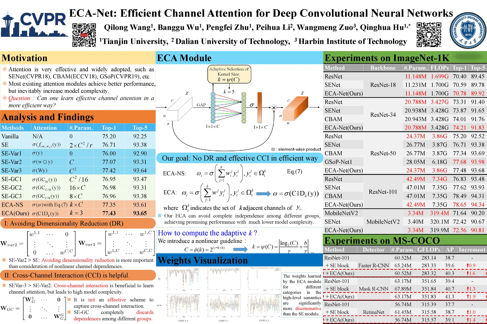
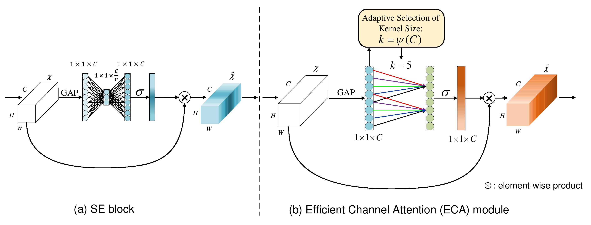

# ECA-Net: Efficient Channel Attention

ECA-Net: Efficient Channel Attention for Deep Convolutional Neural Networks

This is an implementation of ECA-Net(CVPR2020,[paper](https://arxiv.org/abs/1910.03151)), created by Banggu Wu.



## Introduction
Recently, channel attention mechanism has demonstrated to offer great potential in improving the performance of deep convolutional neuralnetworks (CNNs). However, most existing methods dedicate to developing more sophisticated attention modules for achieving better performance,which inevitably increase model complexity. To overcome the paradox of performance and complexity trade-off, this paper proposes an EfficientChannel Attention (ECA) module, which only involves a handful of parameters while bringing clear performance gain. By dissecting the channelattention module in SENet, we empirically show avoiding dimensionality reduction is important for learning channel attention, and appropriatecross-channel interaction can preserve performance while significantly decreasing model complexity. Therefore, we propose a localcross-channel interaction strategy without dimensionality reduction, which can be efficiently implemented via `1D` convolution. Furthermore,we develop a method to adaptively select kernel size of `1D` convolution, determining coverage of local cross-channel interaction. Theproposed ECA module is efficient yet effective, e.g., the parameters and computations of our modules against backbone of ResNet50 are 80 vs.24.37M and 4.7e-4 GFLOPs vs. 3.86 GFLOPs, respectively, and the performance boost is more than 2\% in terms of Top-1 accuracy. We extensivelyevaluate our ECA module on image classification, object detection and instance segmentation with backbones of ResNets and MobileNetV2. Theexperimental results show our module is more efficient while performing favorably against its counterparts.

## Citation

    @InProceedings{wang2020eca,
       title={ECA-Net: Efficient Channel Attention for Deep Convolutional Neural Networks},
       author={Qilong Wang, Banggu Wu, Pengfei Zhu, Peihua Li, Wangmeng Zuo and Qinghua Hu},
       booktitle = {The IEEE Conference on Computer Vision and Pattern Recognition (CVPR)},
       year={2020}
     }

## Changelog
2020/02/26 Upload ECA-Resnet34 model.

2020/03/05 Upload RetinaNet-ecanet50 and RetinaNet-ecanet101 model.

2020/03/24 Update the Introduction and Citation.

2020/03/30 Upload ECA-Resnet18 model.

2020/05/06 Update the poster.

## ECA module



Comparison of (a) SE block and (b) our efficient channel attention (ECA) module. Given the aggregated feature using global average pooling (GAP), SE block computes weights using two FC layers. Differently, ECA generates channel weights by performing a fast 1D convolution of size k, where k is adaptively determined via a function of channel dimension C.

## Installation

### Requirements

- Python 3.5+
- PyTorch 1.0+
- [thop](https://github.com/Lyken17/pytorch-OpCounter)

### Our environments

- OS: Ubuntu 16.04
- CUDA: 9.0/10.0
- Toolkit: PyTorch 1.0/1.1
- GPU: GTX 2080Ti/TiTan XP

### Start Up

#### Train with ResNet

You can run the `main.py` to train or evaluate as follow:

```
CUDA_VISIBLE_DEVICES={device_ids} python main -a {model_name} --ksize {eca_kernel_size} {the path of you datasets}
```
For example:
```
CUDA_VISIBLE_DEVICES=0,1,2,3 python main -a eca_resnet50 --ksize 3557 ./datasets/ILSVRC2012/images
```

#### Train with MobileNet_v2
It is same with above ResNet replace `main.py` by `light_main.py`.

#### Compute the parameters and FLOPs
If you have install [thop](https://github.com/Lyken17/pytorch-OpCounter), you can `paras_flosp.py` to compute the parameters and FLOPs of our models. The usage is below:
```
python paras_flops.py -a {model_name}
```

## Experiments

### ImageNet
|Model|Param.|FLOPs|Top-1(%)|Top-5(%)|BaiduDrive(models)|Extract code|GoogleDrive|
|:---:|:----:|:---:|:------:|:------:|:----------------:|:----------:|:---------:|
|ECA-Net18|11.15M|1.70G|70.92|89.93|[eca_resnet18_k3577](https://pan.baidu.com/s/1Bh9J7VY2tYj5oEvEEqvdhQ)|utsy|[eca_resnet18_k3577](https://drive.google.com/open?id=1LMRFRTyzVifGBi2MUpTuYEWW44S8mwyl)|
|ECA-Net34|20.79M|3.43G|74.21|91.83|[eca_resnet34_k3357](https://pan.baidu.com/s/1FFVUBbbJfNNFhyiZZ2P2AQ)|o4dh|[eca_resnet34_k3357](https://drive.google.com/open?id=15LV5Jkea3GPzvLP5__H7Gg88oNQUxBDE)|
|ECA-Net50|24.37M|3.86G|77.42|93.62|[eca_resnet50_k3557](https://pan.baidu.com/s/18LXDcxy8qG66h-7FlWW4SA)|no6u|[eca_resnet50_k3557](https://drive.google.com/open?id=1670rce333c_lyMWFzBlNZoVUvtxbCF_U)|
|ECA-Net101|42.49M|7.35G|78.65|94.34|[eca_resnet101_k3357](https://pan.baidu.com/s/1-ageRP2tku-YSIOqU09WpA)|iov1|[eca_resnet101_k3357](https://drive.google.com/open?id=1b5FQ8yDFnZ_UhvWT9txmjI_LjbKkgnvC)|
|ECA-Net152|57.41M|10.83G|78.92|94.55|[eca_resnet152_k3357](https://pan.baidu.com/s/1tPxHAltlcpI93CXUkW9ZOQ)|xaft|[eca_resnet152_k3357](https://drive.google.com/open?id=1_bYnaOg9ptsILC_iC7uQ5Izv-u2rjYG5)|
|ECA-MobileNet_v2|3.34M|319.9M|72.56|90.81|[eca_mobilenetv2_k13](https://pan.baidu.com/s/143B03YTGE2ogkPoCj3IorQ)|atpt|[eca_mobilenetv2_k13](https://drive.google.com/open?id=1FxzeXPg1SJQZzVVH4HRjMeq_SVMfidUm)|

### COCO 2017

#### Detection with Faster R-CNN and Mask R-CNN
|Model|Param.|FLOPs|AP|AP_50|AP_75|Pre trained models|Extract code|GoogleDrive|
|:----|:----:|:---:|:--:|:-------:|:-------:|:----------------:|:----------:|:---------:|
|Fast_R-CNN_ecanet50|41.53M|207.18G|38.0|60.6|40.9|[faster_rcnn_ecanet50_k5_bs8_lr0.01](https://pan.baidu.com/s/16mjevcCIG7dPWlmrqRNYEQ)|divf|[faster_rcnn_ecanet50_k5_bs8_lr0.01](https://drive.google.com/open?id=1myjDQIHRiYdTXm7DJjlFe_oyALhHXkrS)|
|Fast_R-CNN_ecanet101|60.52M|283.32G|40.3|62.9|44.0|[faster_rcnn_ecanet101_3357_bs8_lr0.01](https://pan.baidu.com/s/1Ag96zDW7R0PVVZsNaJ9XCQ)|d3kd|[faster_rcnn_ecanet101_3357_bs8_lr0.01](https://drive.google.com/open?id=1otCeuTSs4DRLTBIO6cYjm7e-5dQK1dMX)|
|Mask_R-CNN_ecanet50|44.18M|275.69G|39.0|61.3|42.1|[mask_rcnn_ecanet50_k3377_bs8_lr0.01](https://pan.baidu.com/s/1h_2PgK4PMHa2nTIqU3ZNkQ)|xe19|[mask_rcnn_ecanet50_k3377_bs8_lr0.01](https://drive.google.com/open?id=1z5sAqOD6zZzoVOyAd2VmBztmMXUKy-Nv)|
|Mask_R-CNN_ecanet101|63.17M|351.83G|41.3|63.1|44.8|[mask_rcnn_ecanet101_k3357_bs8_lr0.01](https://pan.baidu.com/s/19gph8Sr5nv11_kCecEyu5w)|y5e9|[mask_rcnn_ecanet101_k3357_bs8_lr0.01](https://drive.google.com/open?id=1Rv-VjdfWOt5mE45M0lihgv59fqnCAHQq)|
|RetinaNet_ecanet50|37.74M|239.43G|37.3|57.7|39.6|[RetinaNet_ecanet50_k3377_bs8_lr0.01](https://pan.baidu.com/s/1uL-EwILJVeW7O2O3oBmO0A)|my44|[RetinaNet_ecanet50_k3377_bs8_lr0.01](https://drive.google.com/open?id=1Pp6gndZFiZZo2BdbVmzUKQUtQ1m4kIbW)|
|RetinaNet_ecanet101|56.74M|315.57G|39.1|59.9|41.8|[RetinaNet_ecanet101_k3357_bs8_lr0.01](https://pan.baidu.com/s/1Rt3ijSItumSlqHFjS4J51w)|2eu5|[RetinaNet_ecanet101_k3357_bs8_lr0.01](https://drive.google.com/open?id=1290duDtOGMpp3QrL47CRAq24oGPgbtct)|

#### Instance segmentation with Mask R-CNN
|Model|Param.|FLOPs|AP|AP_50|AP_75|Pre trained models|Extract code|GoogleDrive|
|:----|:----:|:---:|:--:|:-------:|:-------:|:----------------:|:----------:|:---------:|
|Mask_R-CNN_ecanet50|44.18M|275.69G|35.6|58.1|37.7|[mask_rcnn_ecanet50_k3377_bs8_lr0.01](https://pan.baidu.com/s/1h_2PgK4PMHa2nTIqU3ZNkQ)|xe19|[mask_rcnn_ecanet50_k3377_bs8_lr0.01](https://drive.google.com/open?id=1z5sAqOD6zZzoVOyAd2VmBztmMXUKy-Nv)|
|Mask_R-CNN_ecanet101|63.17M|351.83G|37.4|59.9|39.8|[mask_rcnn_ecanet101_k3357_bs8_lr0.01](https://pan.baidu.com/s/19gph8Sr5nv11_kCecEyu5w)|y5e9|[mask_rcnn_ecanet101_k3357_bs8_lr0.01](https://drive.google.com/open?id=1Rv-VjdfWOt5mE45M0lihgv59fqnCAHQq)|
|RetinaNet_ecanet50|37.74M|239.43G|35.6|58.1|37.7|[RetinaNet_ecanet50_k3377_bs8_lr0.01](https://pan.baidu.com/s/1uL-EwILJVeW7O2O3oBmO0A)|my44|[RetinaNet_ecanet50_k3377_bs8_lr0.01](https://drive.google.com/open?id=1Pp6gndZFiZZo2BdbVmzUKQUtQ1m4kIbW)|
|RetinaNet_ecanet101|56.74M|315.57G|37.4|59.9|39.8|[RetinaNet_ecanet101_k3357_bs8_lr0.01](https://pan.baidu.com/s/1Rt3ijSItumSlqHFjS4J51w)|2eu5|[RetinaNet_ecanet101_k3357_bs8_lr0.01](https://drive.google.com/open?id=1290duDtOGMpp3QrL47CRAq24oGPgbtct)|

## Contact Information

If you have any suggestion or question, you can leave a message here or contact us directly: wubanggu@tju.edu.cn . Thanks for your attention!
